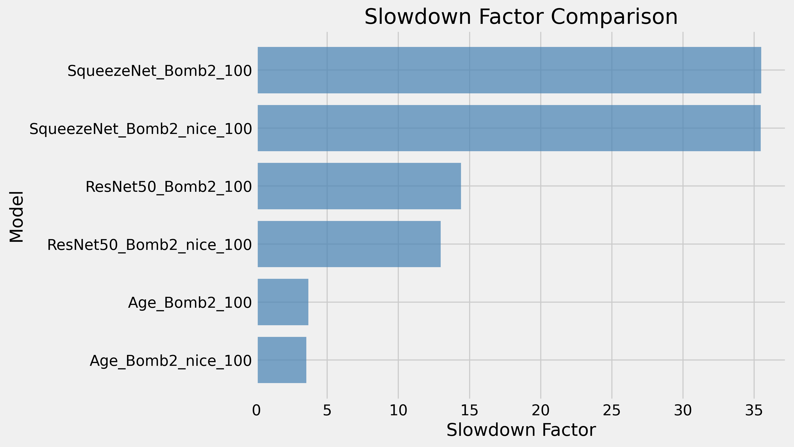
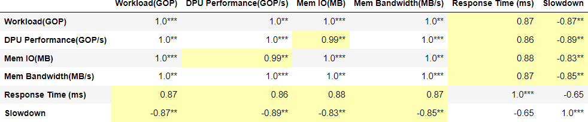
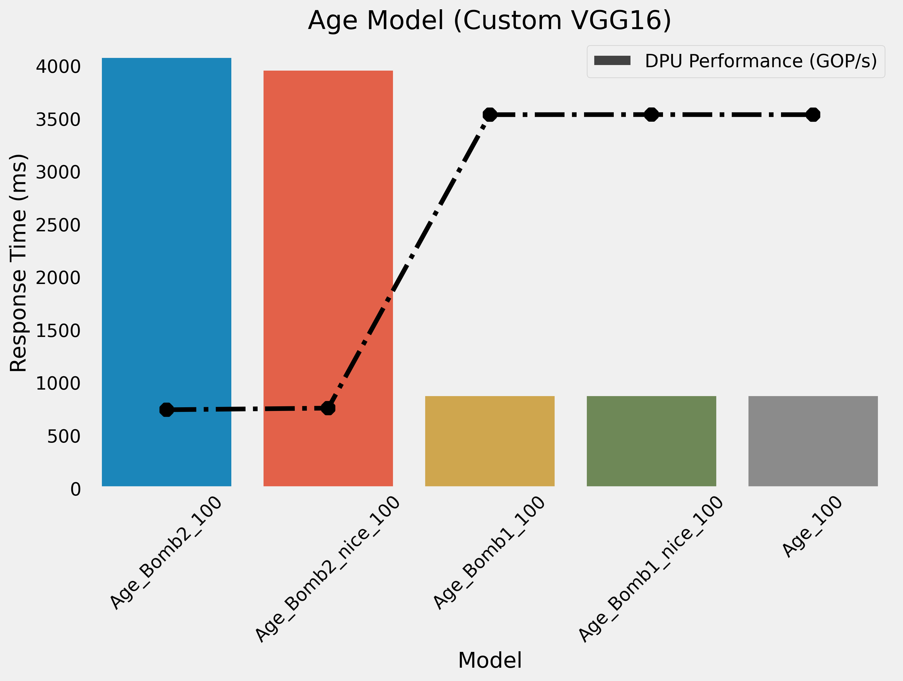
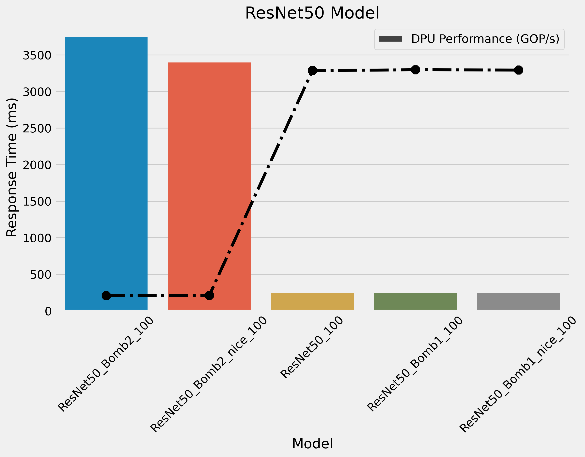
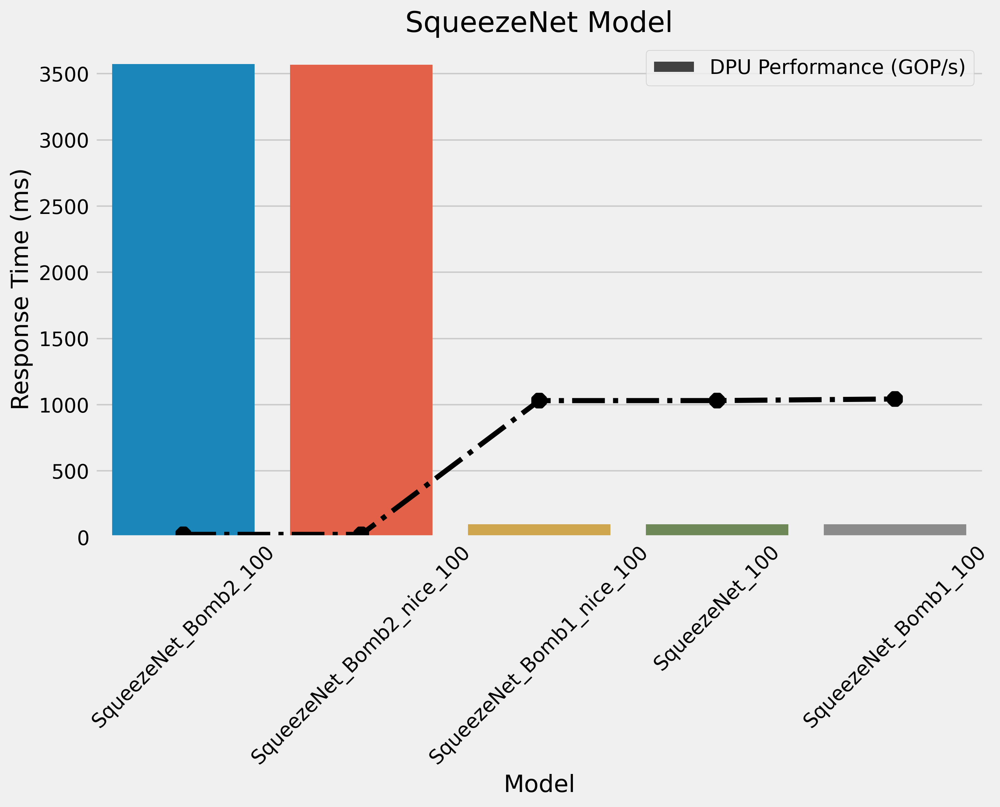

# Results

##  Slowdown factor comparison

The following chart displays the slowdown factor of Deep Neural Networks models accelerated on Versal AI Engine in presence of contention on shared resources.

  

Among the models listed, SqueezeNet demonstrates the highest slowdown factor, approximately 35 times slower compared to the baseline. This means that SqueezeNet experiences a significant degradation in performance when accessing shared resources, particularly due to its lightweight architecture. SqueezeNet has the fewest parameters, only 5 MB, among all the models considered.

On the other hand, AgeNet, which is a custom VGG16-based network, exhibits a slowdown factor of around 4. This implies that AgeNet's performance is less affected by resource access delays compared to SqueezeNet but still experiences a noticeable slowdown.

The distinction between the two types of memory bombs, one with priority given to the scheduler and the other without, does not show any significant differences in terms of slowdown. This suggests that the scheduling priority does not have a substantial impact on the observed slowdown factors.

## Spearman's rank correlation coefficient

The following chart displays the Spearman's rank correlation coefficient of Deep Neural Networks models trace measurements in presence of contention on shared resources.

  

##  Age detection model

  

##  ResNet50 model

  

##  SqueezeNet model

  

